# NBA Analytics Pipeline
*Using Data Analysis and Cloud Computing to Better Pick NBA Players For NBA Fantasy*

Links: 
[](https://www.linkedin.com/in/eric-hoang-5a6934329/)
[](https://powerbi.microsoft.com/)
[](https://medium.com/@erich18002/using-data-analysis-and-cloud-computing-to-better-pick-nba-players-for-nba-fantasy-417389d9c70e)

Tech stack: 


<div align="center">

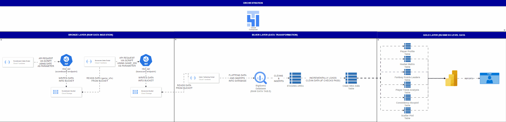

**Result: Ranked 33rd out of all fantasy players in Canada this season**

</div>

## Overview

When I first started participating in NBA fantasy, I always thought my intuition and general basketball knowledge would be more than enough to win in these leagues. However, as that season progressed, I soon realized how wrong I was, and that the level of success I wanted required me to step beyond my comfort zone and pushed me to learn new skills that would not only help me gain a competitive advantage in fantasy basketball, but also feed into my interest of building complete automated end-to-end systems, with data engineering principles and practices in mind.

What started as wanting to try out fantasy to see where I rank turned into discovering what I want to do with my career, which is to use data to make better decisions.

## Architecture

I chose to use the Medallion Architecture because of its simplicity, and its layered approach that provides a clear overview of how data flows within the pipeline. By using this architecture you can directly see how data moves and changes as it goes through each layer. An additional benefit of this architecture is that you can isolate problems should any happen.

### Bronze Layer Breakdown

This layer is responsible for extracting raw data from the NBA API and storing it in Google Cloud Storage. The way my pipeline works is through a two-step process where I make a request to the endpoint scoreboardv2 using yesterday's date as the required parameter. The endpoint returns a list full of game IDs specific to that day. These game IDs are necessary because they serve as a required parameter for boxscoretraditionalv3, the second endpoint.

**Technical Implementation Details**

I chose to save the responses from the API in the Parquet format since it is fundamentally more efficient than other file formats such as CSVs. Due to its columnar storage design, similar data types can be compressed together, resulting in better compression. In an industry-grade environment where large amounts of data are stored in cloud servers that charge you based on size, the benefits of Parquet files result in lower costs as data grows.

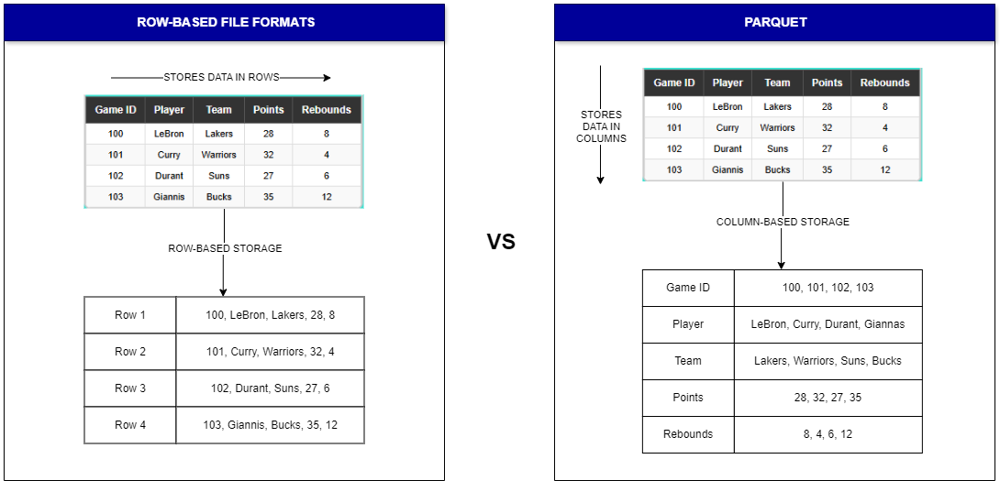

As for data organization, I partitioned the data to organize the files into a year/month/day structure, which serves two main purposes in my pipeline. First, it provides clear data organization, as I can easily locate and access specific dates without having to go through massive amounts of files. Second, it enables me to do incremental loading, which is more efficient.

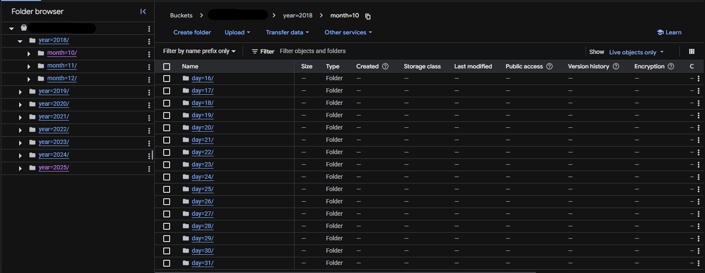

### Silver Layer Breakdown

The silver layer takes the raw data I retrieved in the Bronze layer, and transforms it into clean, structured, business-ready data to be inserted into BigQuery. The transformation happens in two main parts. First, a Cloud Function runs my Python script to incrementally load and extract and flatten the nested, complex data from Google Cloud Storage, then inserts it directly into BigQuery. Second, a stored procedure cleans and standardizes this data, inserting the final results into my clean data table.

**Parallel Processing Optimization**

I used joblib, a Python library that provides tools for parallel computing, to process data more efficiently. My initial version of this script processed games sequentially, which worked fine when there weren't many games played that day. However, on days with up to 10 games being played, the pipeline became noticeably slower.

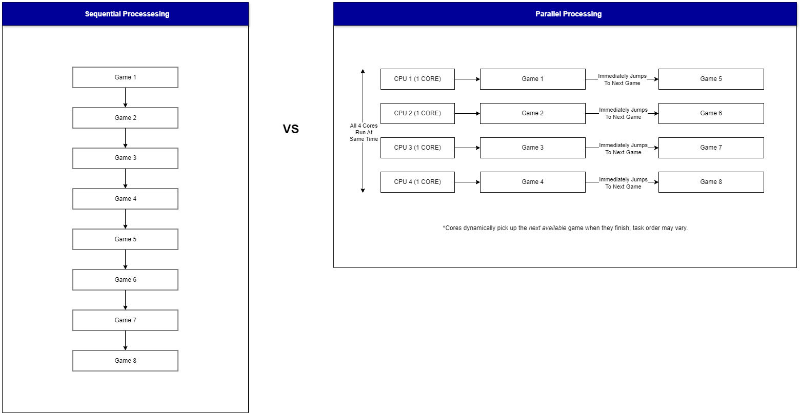

The way parallel processing works, is it essentially executes multiple tasks simultaneously across multiple CPU cores. So instead of processing NBA games one after another, parallel processing allows me to process multiple games at the same time. This greatly reduces the total time it takes to process games. If I were to work with larger datasets with massive amounts of data, I would shift from using joblib to Apache Spark. This tool uses a distributed network of computers to run tasks in parallel, rather than my current setup that utilizes multiple cores on a single machine. This becomes increasingly important as data scales to enterprise levels, where optimization becomes critical for both data processing efficiency and reducing cloud computing costs.

```python
def process_yesterdays_games(self):
    blobs = list(self.storage_client.bucket(self.bucket_name).list_blobs(prefix=self.date_path))
    
    if not blobs:
        print("No files found for " + self.date_parameter)
        return []

    parallel_results = Parallel(n_jobs=4, prefer="processes")(
        delayed(process_single_file)(self.storage_client, self.bucket_name, blob.name)
        for blob in blobs
    )
```

As for data warehousing, I specifically chose BigQuery due to its focus on Online Analytical Processing (OLAP). Unlike Online Transaction Processing (OLTP), which is optimized mainly for small, frequent transactions, BigQuery excels at complex aggregations across large datasets and overall data analysis, making it a perfect fit for my project.

### Gold Layer Breakdown

The final layer of my data pipeline is responsible for transforming the clean data from the silver layer, to business-level tables that power my visualizations in Power BI. This is done by creating SQL queries that perform the aggregates and calculations, which are then saved as a stored procedure. By performing my calculations in BigQuery rather than in Power BI, I have complete control over when I want these stored procedures to run.

The main principle I tried to implement is ensuring the query atomic. Atomic operations ensure that each procedure either fails or succeeds completely, with no in-between. This is important because if my query wasn't atomic, procedures that fail midway through could leave my data in a broken state.

## Data Quality and Auditing

While there's a good chance that the NBA data I'm collecting is going to be accurate, I can't assume that it's going to be all the time, so I applied concepts used in enterprise-level systems to ensure the data I collect is in fact good data. Before any data reaches my final tables, I implement a Write-Audit-Publish (WAP) process to ensure data quality and reliability.

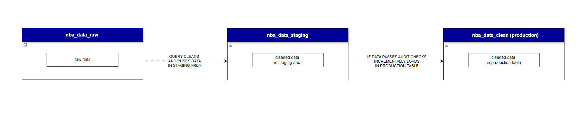

<div align="center">

| Dataset | Purpose | Contents |
|---------|---------|----------|
| `nba_data_raw` | Raw storage | Flattened JSON responses from API |
| `nba_data_staging` | Quality validation | Cleaned data awaiting audit checks |
| `nba_data_clean` | Production | Verified data powering dashboards |

</div>

WAP is a three-step verification process that acts as my final quality checkpoint before data reaches my dashboard. First I Write clean data to a staging area, then I Audit that data through automated quality checks, and finally I Publish the data to production only if it passes every single audit.

### The Seven Quality Checks

My implementation includes seven different audit checks that scan for different types of data quality issues:

1. **Shooting Logic** - Players can't make more shots than they attempted
2. **Minutes Range** - No player plays more than 65 minutes in a single game  
3. **Valid Percentages** - Shooting percentages fall within 0-100% ranges
4. **Rebound Math** - Total rebounds equal the sum of offensive and defensive rebounds
5. **No Negative Stats** - Can't have negative assists, points, steals, etc.
6. **Required Fields** - Player IDs, game dates, and team IDs must exist
7. **No Duplicates** - Same player can't appear twice in one game

If any of these audits fail, the pipeline stops immediately and the bad data gets trapped in staging rather than reaching my production tables.

## Orchestration

Just like the name, orchestration refers to the automated coordination and management of tasks within the data pipeline, just like a conductor orchestrating a band. So instead of manually starting tasks one by one, orchestration automatically manages when tasks start, wait for dependencies to complete, and restart failed tasks. For my orchestration, I chose to create a DAG using Google Cloud Composer, which is Google's managed version of Apache Airflow.

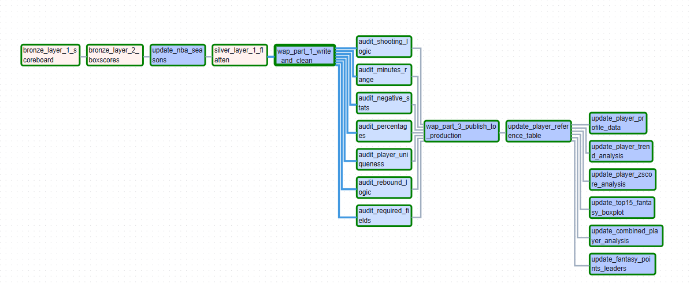

My DAG manages my pipeline by organizing tasks into two main phases. The first phase runs tasks one after another in a specific sequence collecting scoreboard data, collecting boxscore data, updating season information, cleaning the data, then executing the WAP process which validates data quality through seven automated checks before allowing it to reach production tables. The second phase allows six different analysis tables to be created simultaneously once the reference table is ready, including player profiles, fantasy statistics, and performance analysis.

## The Dashboard

In terms of creating the analytics dashboard, I opted to use Power BI as my visualization tool due to familiarity and its seamless and simple integration with BigQuery, allowing me to directly connect to my data warehouse without any additional steps.

### Dashboard Page 1 - Individual Player Profiles

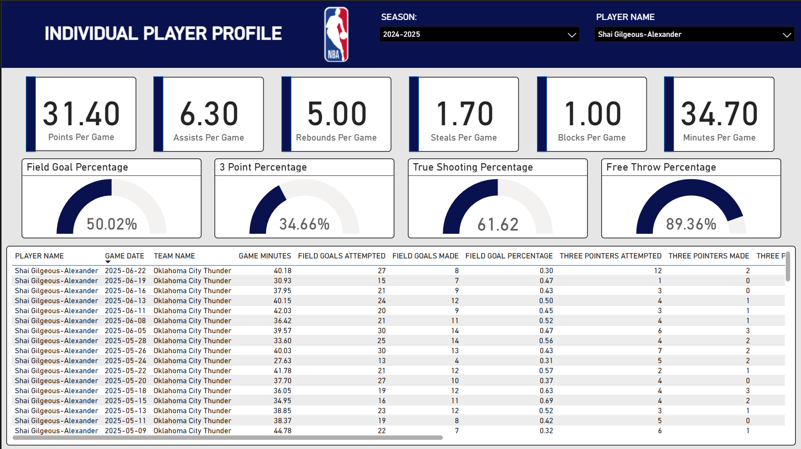

The main purpose of this page is to quickly give users a comprehensive snapshot of any player they are interested in, with slicers near the top that allow users to select specific seasons and players. In terms of layout design, I wanted to organize the information in order of importance for decision-making, starting with six key performance KPIs that immediately tell you roughly how well the player is performing. Below that, I included shooting percentage gauges that provide a quick visual check of how well they shoot across different areas. Finally, I added a game-by-game stats table that shows recent game history for those who want a deeper look.

### Dashboard Page 2 - Performance Heat Map

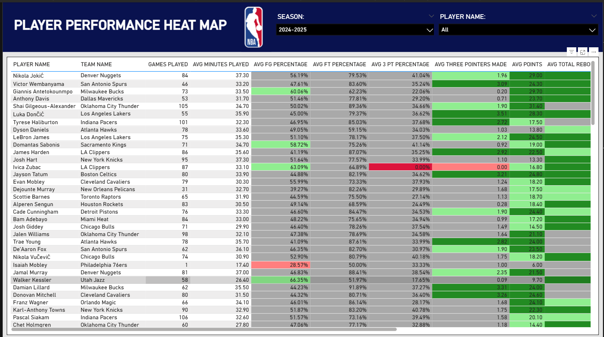

Moving on to the second page, the purpose of this heat map is to provide users with a comprehensive, statistically-driven player comparison tool for fantasy basketball. To better illustrate the use of this tool, let's use Nikola Jokic's rebounding performance as an example. His rebounding cell appears dark green, which means he performs more than two standard deviations above the league average and ranks in the top 2.3% of players in rebounding.

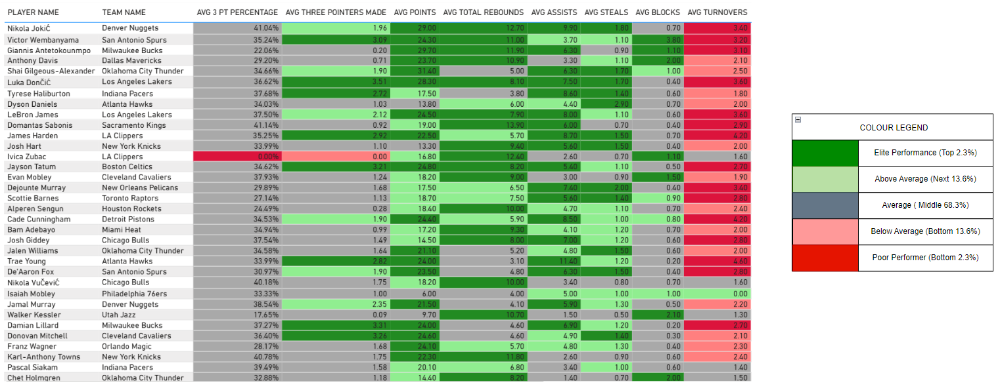

**Statistical Methodology**

The heat map uses Z-score calculations and the empirical rule to objectively rank player performance across all statistical categories. First, I calculate the league-wide mean and standard deviation for each statistic, then apply the Z-score formula (Player's Average - League Average) / Standard Deviation to determine how many standard deviations above or below the league average each player performs.

<div align="center">

| Performance Level | Z-Score Range | Percentage of Players | Color |
|------------------|---------------|---------------------|-------|
| Elite | Z ≥ +2.0 | Top 2.3% | Dark Green |
| Above Average | +1.0 ≤ Z < +2.0 | Next 13.6% | Light Green |
| Average | -1.0 ≤ Z < +1.0 | Middle 68.3% | Gray |
| Below Average | -2.0 ≤ Z < -1.0 | Bottom 13.6% | Light Red |
| Poor | Z < -2.0 | Bottom 2.3% | Dark Red |

</div>

### Dashboard Page 3 - Advanced Analytics

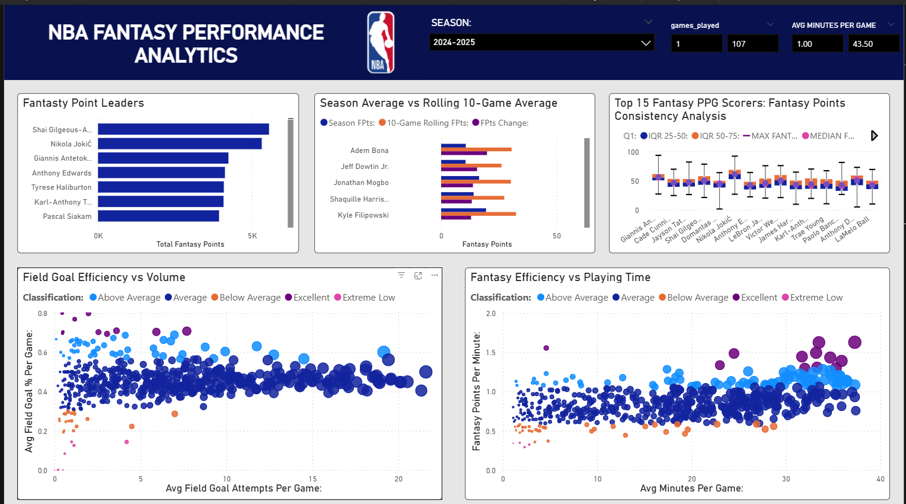

This page of the dashboard provides users with analytical tools used to reveal relationships, patterns, and insights into NBA statistics that aren't immediately obvious from basic data. This page combines multiple visualizations that help users find trends in efficiency, consistency, performance changes, and overall statistical leaders to help users make better fantasy basketball decisions.

**Key Visualizations**

The top row features three visualizations that provide different perspectives on fantasy performance. The first visualization on the left is a bar graph depicting the fantasy point leaders, giving users an immediate view of who generates the most fantasy value overall. The middle chart is a dual-bar graph showing season averages versus rolling 10-game averages, which compares each player's full season performance against their recent trend. The final visualization uses statistical distribution analysis through box plots to show not just how much players score, but how consistent they are.

The bottom row features two scatter plots that analyze performance relationships. The Field Goal Efficiency vs Volume scatter plot examines the relationship between shot attempts and shooting accuracy, answering the critical question of whether players can handle increased offensive responsibility without sacrificing efficiency. The Fantasy Efficiency vs Playing Time scatter plot explores fantasy points per minute against total minutes played, revealing which players maximize their limited opportunities versus those who maintain consistent production across heavy workloads.

## Technical Implementation

### Key Technologies

| Component | Technology | Purpose |
|-----------|------------|---------|
| **Data Extraction** | Google Cloud Functions | Serverless NBA API processing |
| **Data Storage** | Google Cloud Storage | Partitioned Parquet file storage |
| **Data Warehouse** | BigQuery | OLAP-optimized analytics database |
| **Orchestration** | Apache Airflow (Cloud Composer) | Automated pipeline scheduling |
| **Visualization** | Power BI | Interactive dashboard creation |
| **Parallel Processing** | joblib | Multi-core game data processing |

### Performance Optimizations

**Parallel Processing**: Uses joblib to process multiple NBA games simultaneously across 4 CPU cores instead of sequential processing.

**Columnar Storage**: Parquet format provides better compression than CSV files and enables column-specific queries, reducing storage costs and improving query performance.

**Incremental Loading**: Date partitioning (year=2025/month=02/day=09) allows the pipeline to target specific date folders rather than scanning entire buckets, improving efficiency as data scales.

**Atomic Operations**: Three-step table replacement (temporary table creation → validation → atomic swap) prevents partial data updates and ensures users never see incomplete results.

### Data Quality Architecture

The WAP process implements enterprise-grade data validation:

```python
# Example from the DAG - all audits must pass before publishing
[
    audit_shooting_logic,
    audit_minutes_range, 
    audit_percentages,
    audit_rebound_logic,
    audit_negative_stats,
    audit_required_fields,
    audit_player_uniqueness
] >> wap_part_3_publish
```

## Results and Impact

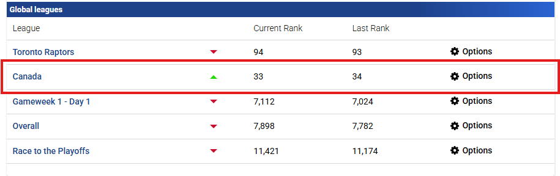

### Fantasy Basketball Performance

Using the dashboards and z-score analysis I built, I finished ranked 33rd out of all fantasy players in Canada this season. This project taught me that data, when used properly, becomes one of the most powerful tools for making critical decisions. Whether it's identifying undervalued players or spotting performance trends others miss, having a systematic approach beats intuition every time.

### Technical Achievements

* **Automated End-to-End Pipeline**: Zero manual intervention required for daily data processing
* **Enterprise Data Quality**: WAP process ensures data validation before dashboard updates
* **Scalable Architecture**: Handles increasing data volumes through parallel processing and cloud-native design
* **Real-Time Analytics**: Provides next-day insights for rapid fantasy decision-making

### Key Learnings

**Data Engineering**: Implemented medallion architecture, parallel processing optimization, comprehensive data quality controls, and automated orchestration using industry best practices.

**Cloud Computing**: Gained hands-on experience with serverless functions, managed databases, object storage, and workflow orchestration on Google Cloud Platform.

**Statistical Analysis**: Applied Z-score calculations, empirical rule distributions, and performance ranking methodologies to create objective player evaluation systems.

**Business Intelligence**: Built interactive dashboards connecting advanced analytics to actionable fantasy basketball insights.
